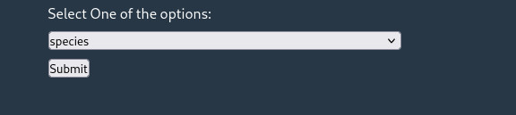

# STARWARS_WEB_APP

## Description
This App will display character names, their attributes and films they are present by fetching data from the [star_wars_api](https://swapi.dev/)

## Table of Components

1. [Installation](#installation)  
2. [Usage](#usage)  
3. [Contributions](#contributions)  
4. [License](#license)  

## Installation

### Requirements:
- node v22.3.0

### Steps
1. Clone the repository:  
``git clone https://github.com/alsongard/Starwars_Web_App.git``  
1. Navigate into the directory:   
``cd star_wars_web_app``
1.  Run the application:  
``npm start``

## Usage
Select one of the options provided in the select list:  
  
## Contributions
The app was created using ``npx create-react-app``. 
Data is fetched from the star wars api and displayed depending on the option selected by the user. 

## License
The project is licensed under the GPlv2 Licencse
